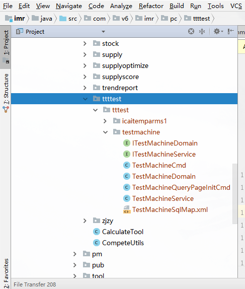
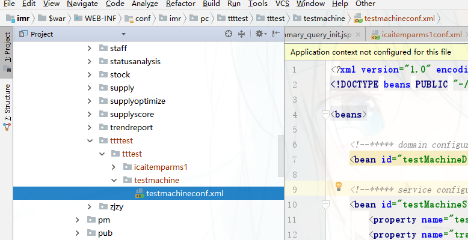
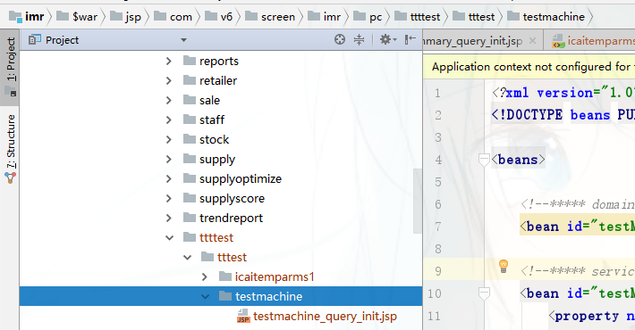

# 基于nodejs的v6代码机

>在v6框架中开发一个新的功能需要新建许多文件，写一些重复的代码，这个代码机能帮助你生成一个简单的单表查询功能，只需要你填入一些简单的配置。

## 安装

    npm install v6mc -g

## 使用说明

    1. 生成配置文件
      
      任意位置新建文件夹
      切换到新建文件夹目录下
      执行  v6mc  （忽略报错）
      删除新建文件夹
       
    2. 修改配置文件

      配置文件是C:\Users\lihang01\.config\configstore\v6-machine.json

      {

        // 数据库相关配置
        type: 'db2',
        DATABASE: 'v6db',
        HOSTNAME: '10.110.1.208',
        UID: 'db2inst1',
        PWD: '',    // 填入数据库密码
        PORT: '50000',
        PROTOCOL: 'TCPIP',

        // 报表相关配置
        // 报表查询表，大写带下划线
        TABLE: 'ICA_ITEM_PARMS1',
        // 查询条件，大写带下划线，用英文逗号隔开
        CONDITION: 'PACK_BAR,DIST_MODE',
        // 模块名称（目前支持IMR和ICA）
        MODULE: 'IMR',

        // 生成文件配置
        // 功能名称，也是生成代码文件名, 驼峰
        FILENAME: 'testMachine',
        // 文件路径，填入 src/com/v6/imr/ 后面的路径
        PATH: 'pc/ttttest/tttest',
        DESC: '我是功能描述',
        AUTHER: '我是码农的名字'

      }

    3. 生成报表代码

      切换到imr/ica工程目录下
      执行  v6mc
      编译，上传，测试
      
>生成文件包含conf.xml文件， default.jsp， jsp文件， command文件， queryCommad文件， service层的接口和实现， domain层的接口和实现， sql的xml文件

## 声明

  **生成的代码仅供参考，对于产生成的bug，本人不承担任何责任**

## 如何贡献代码
1. 先[fork](https://www.zhihu.com/question/20431718)这个代码库。
2. `npm install` 安装所需要的依赖。
4. 提[PR](https://www.zhihu.com/question/21682976).